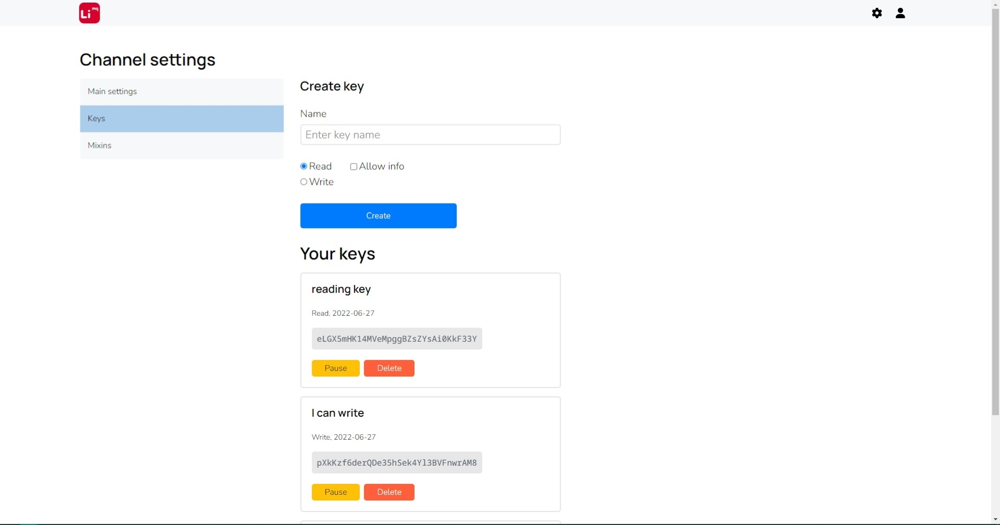

# LiMQ panel frontend repo

This is a React repository containing all the frontend assets for the LiMQ panel.

Another assets for LiMQ are: [LiMQ core api](https://github.com/emmitrin/limq), [LiMQ panel](https://github.com/gaskeo/limq-panel)

[Версия на русском](README.ru.md)

## Features 

#### User interface preferences: language, theme modes (Dark / Light)

#### User account preferences: e-mail, password, personal info

#### Channel preferences, API keys management

